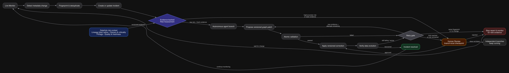

# DATA LAB

DATA LAB is a human-reviewed **data incident-response workspace**. It turns normalized catalog evidence into one focused path—observe, profile, trace impact, assess risk, review a correction and monitor the result.

DataHub is the built-in adapter created for the **Build with DataHub: The Agent Hackathon**, not the domain model. The application core uses the provider-neutral `data-lab.catalog.v1` contract; other systems can connect through an MCP or HTTP adapter without changing graph cards. Native OpenMetadata, dbt-manifest and Snowflake adapters are not claimed as implemented.

**Primary challenge track:** Agents That Do Real Work.

**Project links:** [Devpost draft](https://devpost.com/software/data-lab) · [Public source repository](https://github.com/Complexity-ML/data-lab)

## Why it exists

Most incident tools alert without preserving the evidence and proposed correction in one inspectable object. DATA LAB loads schema, ownership, classifications, profiles and lineage from a connected catalog first. Its agent can therefore answer questions such as:

- Which downstream outputs will receive a PII field?
- Which feature, training dataset or production model is at risk after a schema change?
- What is the smallest reversible graph correction?
- Which evidence changed, and did the post-condition recover?

The starter scenario detects that `customers_360.email` is tagged as PII while the CRM activation path has no masking step. The agent proposes a transform, displays its DataHub reads and graph diff, and waits for explicit human approval.

## Current MVP

- One-click hackathon incident demo backed by a connected local DataHub OSS Docker Quickstart.
- Eight primary incident cards: Source, Profile, Impact, Risk, Patch, Human Review, Validation and Live Monitor.
- The broader pipeline grammar remains available behind **Show advanced pipeline cards**.
- Provider-neutral `catalog.v1` evidence plus a built-in DataHub GraphQL/MCP adapter.
- Agent proposal with exact evidence, tool trace, rationale, graph diff and native approve/reject boundaries.
- Atomic risk gates that keep catalog-collection failures separate from actual data incidents.
- Transactional SQLite workspaces, reports and restorable versions.
- Background monitoring enabled by default: closing the window hides DATA LAB to the system tray instead of destroying its renderer timers.

## Run the hackathon demo

The recorded hackathon scenario is intentionally evidence-backed. Start DataHub OSS with Docker, connect the built-in DataHub adapter, then choose **Start incident demo** on the empty canvas.

Required:

1. a running local DataHub OSS Quickstart in Docker;
2. the DATA LAB DataHub connection reporting **connected**.

An AI provider remains optional unless the video demonstrates generated correction proposals.

## Run the app

Requirements: Node.js 20+ and npm.

```bash
npm install
npm run electron:dev
```

The web renderer can also be started on its own:

```bash
npm run dev
```

Validation:

```bash
npm test
npm run build
npm run build:electron
```

Signed macOS releases provide x64 and arm64 DMG/ZIP artifacts, a default Stable channel, and an explicit Main preview channel. See [macOS releases and updater security](docs/macos-releases.md).

DATA LAB Setup is a lightweight Tauri bootstrap window for macOS and Windows. It shows whether it is building the latest GitHub Release or Main, downloads a verified managed Node.js runtime once, builds Electron locally for the current machine, installs atomically and keeps one rollback copy. Setup previews are unsigned and unnotarized until platform certificates are configured.

Download and open the current macOS Setup from Terminal:

```bash
SETUP_ARCH=$([ "$(uname -m)" = "arm64" ] && echo arm64 || echo x64); curl -fL "https://github.com/Complexity-ML/data-lab/releases/download/setup-latest/DATA-LAB-Setup-${SETUP_ARCH}.dmg" -o /tmp/DATA-LAB-Setup.dmg && open /tmp/DATA-LAB-Setup.dmg
```

Download and launch the current Windows Setup from PowerShell:

```powershell
$setup = "$env:TEMP\DATA-LAB-Setup-x64.exe"; irm "https://github.com/Complexity-ML/data-lab/releases/download/setup-latest/DATA-LAB-Setup-x64.exe" -OutFile $setup; Start-Process $setup
```

Choose **Stable** for the latest published DATA LAB application release (recommended), or **Main** for the newest commit on the main branch. GitHub Actions only packages the small Setup installers; DATA LAB itself is built locally by Setup for the current computer.

## Continuous incident lifecycle

With a bound Data Source and a Live Monitor card, DATA LAB fingerprints catalog metadata, deduplicates repeated findings, records every incident transition in local SQLite, and can ask the agent for a bounded, versioned graph correction. A deterministic host Risk Gate calculates a non-lowerable review floor from evidence freshness, quality, ownership, sensitive fields/tags and lineage blast radius. Low-risk branches continue autonomously; uncertain or high-risk branches wait at their own Human Review checkpoint while unrelated atomic branches remain runnable and new monitor triggers are queued. Recovery and recurrence are preserved as an inspectable incident history.

Collection failures are kept separate from data-quality findings. Offline network routes, DNS failures, refused connections, timeouts, authentication failures and TLS errors appear in Reports as DATA LAB connectivity incidents; they never claim that a dataset or downstream model is unhealthy. Successful source discovery records the corresponding recovery and resumes the bounded player loop.

The normal workflow has no permanent command prompt. **Play** starts the autonomous player and selects relevant sources from labels, URNs, platforms, domains and incident context; **Pause** lets the current atomic iteration finish but prevents the next one; **Stop** cancels the active provider turn and monitoring without changing the last validated graph. On an empty workbench, Play discovers the best available governed source; without a catalog connection it may propose only an unbound Data Source and Human Review, never invented metadata.

Long ChatGPT/Codex planning turns use an activity-aware wait: tool calls and agent messages reset the idle timer, while a separate absolute bound still prevents a permanently stuck run. A timeout never applies a partial proposal, so the current graph remains unchanged and retryable.

When a proposal reaches Human Review, its giant review modal exposes a dedicated read-only agent assistant. The reviewer can ask why the change is needed, what evidence is missing, what could break, or which alternative is safer. Electron rejects every graph mutation tool in this mode: the assistant can explain and recommend, but only the human can approve, reject or request external DataHub write-back.

This monitoring loop remains a desktop process, not a cloud service. By default, closing the window hides DATA LAB to the system tray, disables Chromium background throttling and keeps Live Monitor timers active while the computer and user session remain running. **Quit DATA LAB** stops monitoring explicitly. Operators can opt out in **Settings → Autonomy**. A separately deployable service is still required for server-grade monitoring across reboots and signed-out sessions.



The gate is intentionally asymmetric: the model can explain or raise risk, but it cannot lower the host decision. `max_iterations` and `cooldown` bound repair work; the first changed fingerprint beyond the retry budget creates a native Human Review checkpoint instead of silently spinning or applying another autonomous patch. Every committed “correction” is a DATA LAB graph revision—never a hidden mutation of the source dataset.

Windows keeps its standard system title bar and native minimize, maximize and close controls outside the DATA LAB interface. The Windows CI workflow builds and verifies an unsigned x64 NSIS/ZIP smoke package; unsigned builds cannot use the updater. See [Windows desktop support](docs/windows-desktop.md).

## Connect a local DataHub Quickstart

DataHub's official Quickstart requires Docker with Compose v2, Python 3.10+, and enough Docker resources. The documented tested allocation is 2 CPUs, 8 GB RAM, 2 GB swap and 13 GB disk.

Install the CLI and start DataHub:

```bash
brew install datahub-project/tap/datahub
datahub docker quickstart
```

Then initialize the CLI and load the official showcase catalog:

```bash
datahub init
datahub datapack load showcase-ecommerce
```

`datahub init` stays interactive on purpose: use the local quickstart credentials printed by DataHub instead of committing a password or copying it into shell-history examples.

The DataHub UI is available at `http://localhost:9002`. Create a scoped token for the demo, then launch DATA LAB with the GMS connection owned by Electron's main process:

```bash
DATAHUB_GMS_URL=http://localhost:8080 \
DATAHUB_GMS_TOKEN=your-scoped-token \
npm run electron:dev
```

DATA LAB then starts the official open-source MCP server through `uvx mcp-server-datahub@latest`. Install [`uv`](https://docs.astral.sh/uv/getting-started/installation/) first so `uvx` is available. The server runs over stdio and mutation tools are explicitly disabled by the app.

For a remote DataHub Cloud MCP server, use Streamable HTTP instead:

```bash
DATAHUB_MCP_URL=https://your-tenant.acryl.io/integrations/ai/mcp/ \
DATAHUB_MCP_TOKEN=your-scoped-service-account-token \
npm run electron:dev
```

Do not put the token in a `VITE_*` variable: Vite variables are readable by the renderer.

Official guide: [DataHub Quickstart](https://docs.datahub.com/docs/quickstart).

For the complete verified OSS path, including sanitized MCP evidence, explicit external-provider disclosure, atomic approval and teardown, see [`docs/datahub-oss-e2e.md`](docs/datahub-oss-e2e.md) and [`examples/datahub-oss/`](examples/datahub-oss/).

## DataHub MCP and Skills workflow

The agent workflow is implemented around the DataHub MCP Server:

1. `search` / `get_entities` find the relevant source and its full metadata.
2. `list_schema_fields` identifies classified fields such as PII.
3. `get_lineage` traces the impact radius and downstream outputs.
4. The local validator turns that context into a constrained graph proposal.
5. A human approves or rejects the full diff.
6. Atomic checks validate the complete candidate before a new pipeline version is committed.
7. Mutation tools such as `save_document` or governed proposals preserve the decision for the next person or agent.

The MCP documentation distinguishes read-only and mutation tools, and mutation tools must be explicitly enabled. For unattended workflows, DataHub recommends a service account rather than a personal token.

The complementary DataHub Skills provide workflow instructions on top of MCP tools. DATA LAB maps them as follows:

- `datahub-search`: resolve trusted source datasets.
- `datahub-lineage`: inspect upstream and downstream impact.
- `datahub-quality`: check health signals before proposing a change.
- `datahub-enrich`: write approved context and governance metadata back.

See [DataHub MCP Server](https://docs.datahub.com/docs/features/feature-guides/mcp) and [DataHub Skills](https://docs.datahub.com/docs/dev-guides/agent-context/skills).

## Evidence and screenshots

- [Sanitized DataHub OSS MCP evidence](examples/datahub-oss/mcp-evidence.json)
- [Reviewed graph correction](examples/datahub-oss/reviewed-correction.json)
- [Importable approved pipeline and evidence checkpoint](examples/datahub-oss/reviewed-pipeline.json)
- [Atomic validation and replay report](examples/datahub-oss/validation-report.json)
- [Final application screenshots](docs/hackathon-submission.md#application-screenshots)
- [Captioned 2:20 demo draft](docs/assets/data-lab-demo-draft.mp4)

## Security model

- Electron renderer isolation is enabled (`contextIsolation`, `sandbox`, no Node integration).
- Catalog URLs and tokens remain in the Electron main process.
- IPC only exposes status and a bounded dataset-context read.
- The renderer can request a fixed three-tool MCP audit, but cannot invoke arbitrary tools.
- MCP mutation tools are disabled for the locally launched server.
- Dataset URNs are validated and requests time out.
- Agent graph changes are proposals, never silent mutations.
- The local incident demo contains no secret and needs no catalog or AI dependency.

## Project structure

```text
electron/          Secure desktop shell and catalog adapters
src/components/    Pipeline cards and human review UI
src/domain/        Typed graph, validation and agent proposal logic
examples/          Judge-readable sample agent artifacts
docs/              Architecture, submission copy and demo script
config/            DataHub MCP configuration example
```

Optional synthetic scenarios are loaded explicitly from **Settings → Examples**; the default workbench remains blank. Judge-readable expected validations and agent diffs for PII masking, ML lineage/schema impact, and broken ownership/quality are available in [`examples/presets/`](examples/presets/).

## License

Apache License 2.0. See [LICENSE](LICENSE).
