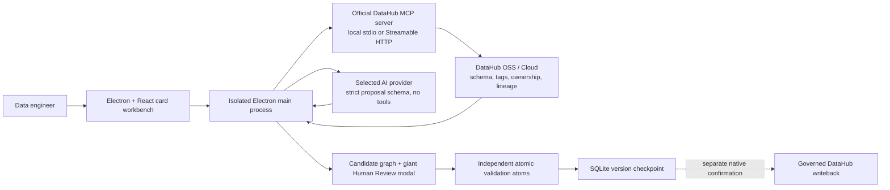
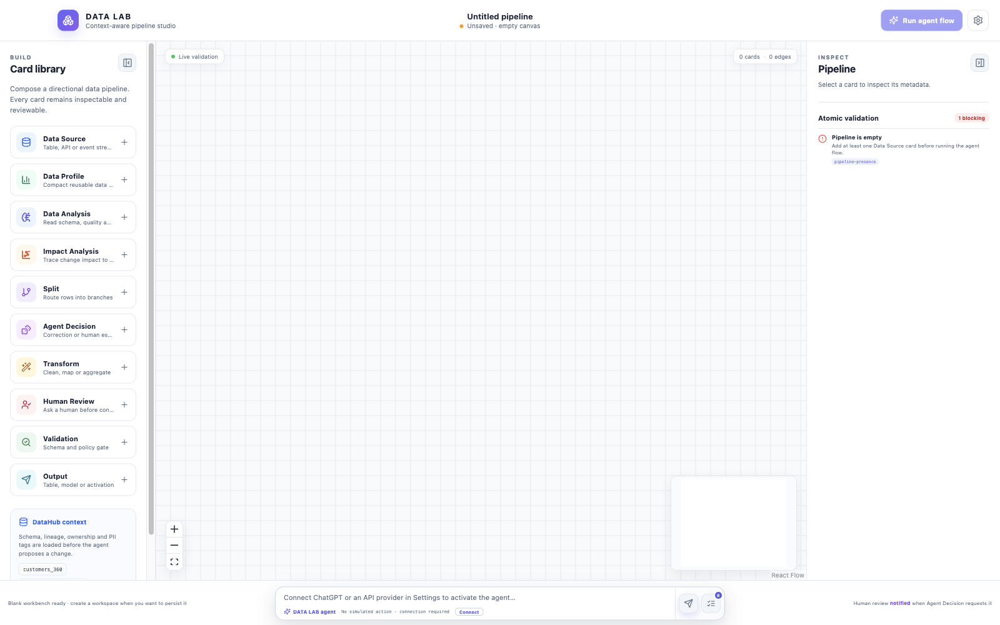
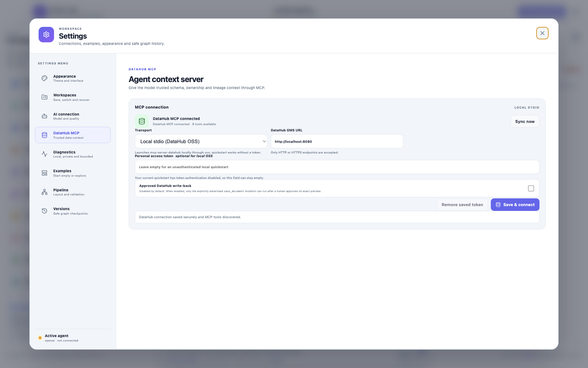
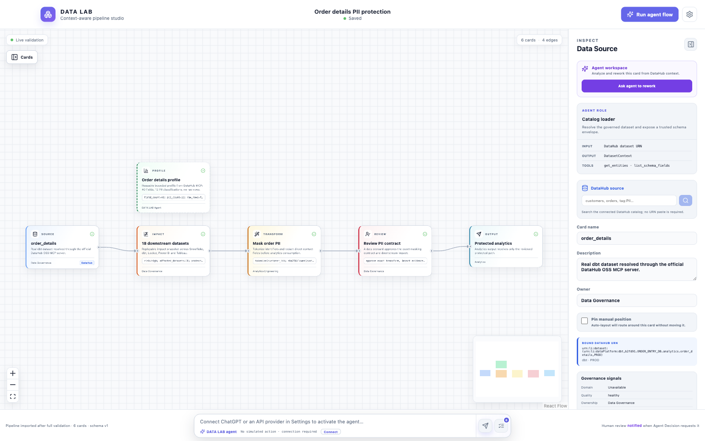
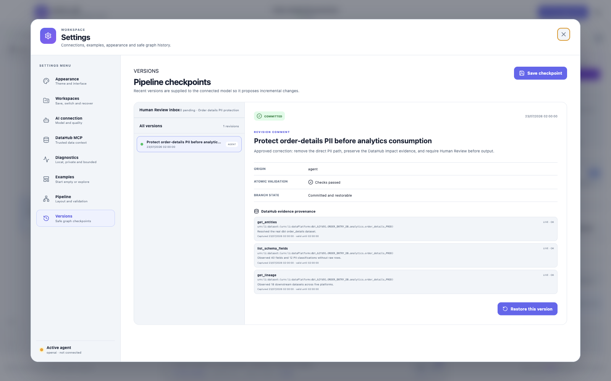
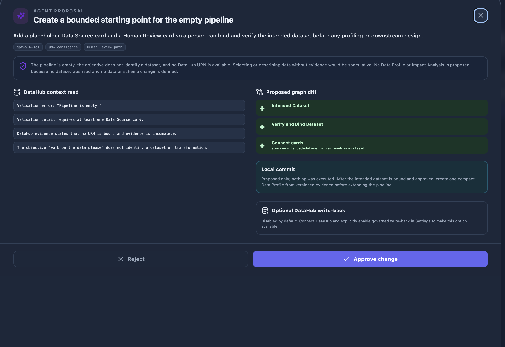

# Hackathon submission package

## Project title

DATA LAB — Human-reviewed data pipeline agents

## Challenge

**Agents That Do Real Work**

## Verified project links

- Devpost project: <https://devpost.com/software/data-lab>
- Public Apache-2.0 repository: <https://github.com/Complexity-ML/data-lab>
- Demo video: pending final public YouTube or Vimeo upload
- Downloadable captioned demo draft (2:20): [`data-lab-demo-draft.mp4`](assets/data-lab-demo-draft.mp4)

## One-line pitch

DATA LAB turns live DataHub context into an editable, replayable card pipeline where an AI agent can find lineage and governance risks, propose a precise graph correction, and preserve the approved decision without taking control away from the data team.

## Final project description

DATA LAB is an Electron visual pipeline studio grounded in DataHub schemas, lineage, ownership, quality, and governance metadata. A user starts from a blank workbench, binds an actual DataHub dataset to a Data Source card, and asks the agent to investigate or improve the pipeline. Before proposing a change, DATA LAB reads the catalog through the official DataHub MCP server and records the exact evidence snapshot used by the revision.

The agent cannot invoke arbitrary MCP tools or silently change the graph. It returns a strict, bounded graph diff composed from inspectable card roles such as Data Profile, Impact Analysis, Transform, Agent Decision, Human Review, Validation, and Output. The candidate graph is materialized separately, checked by independent atomic validation rules, and displayed in a large review modal. Rejection leaves the committed graph unchanged; approval creates a versioned checkpoint that can be replayed or stopped before the next atomic card commit.

The verified DataHub OSS scenario uses the official ecommerce showcase. DATA LAB resolves the real dbt `order_details` dataset, reads 40 schema fields, identifies 12 PII classifications, and observes 18 downstream datasets across Snowflake, dbt, Looker, Power BI, and Tableau. A direct analytics path is blocked because customer contact fields are unprotected. The reviewed correction adds compact profile memory, an atomic impact snapshot, deterministic PII protection, and a Human Review gate before the existing output.

## Why DataHub is essential

Without DataHub, the model would have to invent table names, schemas, sensitivity classifications, owners, and downstream impact. DATA LAB instead uses:

1. `get_entities` to resolve and inspect the source asset.
2. `list_schema_fields` to read the actual schema and governance terms.
3. `get_lineage` to calculate the downstream impact radius.
4. DataHub-owned evidence timestamps and version memory to make revisions reproducible.
5. An optional, separately confirmed writeback to preserve approved decisions for the next person or agent.

## Architecture



Trust boundaries and failure modes are detailed in [`threat-model.md`](threat-model.md). The real OSS verification procedure is in [`datahub-oss-e2e.md`](datahub-oss-e2e.md).

## Technology

- Electron, React 19, TypeScript, and SCSS
- React Flow for the directional, inspectable card graph
- Official Model Context Protocol TypeScript SDK
- Official DataHub MCP server over local stdio or remote Streamable HTTP
- ChatGPT account connection plus OpenAI, Anthropic Claude, and Moonshot Kimi API providers
- SQLite for local workspace, version, review, and diagnostics persistence
- Vitest for domain, UI, IPC, validation, security, and end-to-end acceptance tests

## Judge-readable evidence

- [`examples/datahub-oss/mcp-evidence.json`](../examples/datahub-oss/mcp-evidence.json): sanitized successful MCP reads.
- [`examples/datahub-oss/reviewed-correction.json`](../examples/datahub-oss/reviewed-correction.json): complete reviewed graph diff.
- [`examples/datahub-oss/reviewed-pipeline.json`](../examples/datahub-oss/reviewed-pipeline.json): importable approved graph and evidence checkpoint.
- [`examples/datahub-oss/validation-report.json`](../examples/datahub-oss/validation-report.json): validation and atomic replay results.
- [`examples/generated-transform.sql`](../examples/generated-transform.sql): sample generated transformation artifact.
- [`devpost-submission-answers.md`](devpost-submission-answers.md): verified form answers and actionable DataHub feedback draft.

No raw rows, credentials, authorization headers, or provider secrets are committed.

## Application screenshots

### Honest blank workbench



### Official DataHub MCP connected to local OSS



### Reviewed PII-protection graph



### Version checkpoint with DataHub evidence provenance



### Agent proposal review



## Demo script — target 2:45

The repository includes a silent, captioned 2:20 draft assembled from the verified desktop states. Regenerate it on macOS without recording the desktop:

```bash
DEVELOPER_DIR=/Applications/Xcode.app \
  CLANG_MODULE_CACHE_PATH=/tmp/data-lab-swift-cache \
  xcrun swift scripts/render-demo-video.swift "$PWD" docs/assets/data-lab-demo-draft.mp4
```

Add narration or upload the captioned draft as-is, then replace the pending public-video URL above with the final YouTube or Vimeo link.

**0:00–0:15 — Blank, honest start**

Launch DATA LAB on the blank persisted workbench. Explain that no healthy result or fake checkpoint exists before a real source is added.

**0:15–0:40 — Live DataHub context**

Open Settings → Connections and show the local DataHub OSS MCP connection. Search and bind the real `order_details` dataset. Select its source card and show the URN, 40 fields, PII classifications, and evidence freshness.

**0:40–1:05 — Independent validation**

Connect the source directly to the analytics output. Show the blocking finding that sensitive data reaches an output without masking. Mention that the same atom is deterministic and independent from the model.

**1:05–1:40 — Agent does real work**

Ask the agent to protect PII. Keep the activity indicator inside Agentic Context while the graph remains usable. Open the proposed revision modal and show the three DataHub reads, rationale, confidence, and full card/edge diff.

**1:40–2:10 — Human control and atomic replay**

Show that the committed graph is unchanged before review. Approve the exact revision: the direct edge disappears and the profile, impact, protection, and Human Review cards become a connected path. Run validation, then show execution waiting at Human Review and completing only after approval.

**2:10–2:35 — Knowledge inheritance**

Open Versions, show the revision description and DataHub evidence snapshot, then restore or replay it. Show the intended DataHub writeback, which still requires a separate native confirmation.

**2:35–2:45 — Close**

“DATA LAB gives agents the catalog context to do real data work and gives humans an atomic, replayable boundary before that work becomes real.”

## Local judge setup

```bash
npm install
npm test
npm run electron:dev
```

The blank workbench and synthetic presets work without credentials. For the real DataHub OSS scenario:

```bash
datahub docker quickstart
datahub init
datahub datapack load showcase-ecommerce
DATAHUB_GMS_URL=http://localhost:8080 npm run electron:dev
```

`datahub init` is interactive so no password is committed. Full instructions and teardown are in [`datahub-oss-e2e.md`](datahub-oss-e2e.md).

## Submission checklist

- [x] Public Apache-2.0 source license in the repository root.
- [x] Clean local setup with no committed secret.
- [x] Real sanitized DataHub OSS MCP evidence.
- [x] Complete sample graph diff and atomic validation report.
- [x] Final project description, technology list, architecture, and timed demo script.
- [x] Capture final application screenshots after the DataHub OSS revision is visible in the desktop build.
- [x] Render a captioned 2:20 demo draft without recording the operator desktop.
- [ ] Record and publish the final public demo video under three minutes.
- [x] Add the public repository link to Devpost.
- [x] Verify the Devpost description, pitch, and technology list.
- [ ] Add the final public demo video and optional live-demo links to Devpost.
- [ ] Opt in to the feedback survey if desired.

The unchecked external deliverables must be verified before issue #6 is closed.
