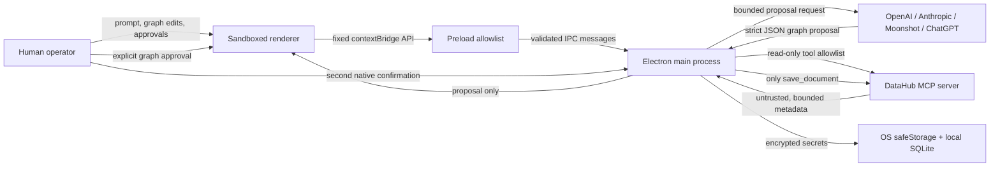

# DATA LAB threat model

This document models the desktop application's renderer, Electron main process, AI providers and DataHub MCP boundary. It focuses on agent planning and governed metadata access; DATA LAB does not execute generated SQL or arbitrary model-selected tools.

## Trust boundaries

The renderer is not trusted with Node.js, credentials, arbitrary IPC channels or arbitrary MCP calls. DataHub catalog content is trusted for provenance only: names, descriptions, owners, tags, schema labels and lineage may be incomplete, stale or malicious and are always treated as untrusted data.

## Protected assets

- DataHub and AI provider credentials.
- Local workspace graphs, versions, review decisions and diagnostic logs.
- Catalog metadata, lineage and governance context.
- The operator's authority to approve a graph revision or external write-back.
- The host filesystem and operating-system session.

## Main threats and controls

| Threat | Boundary | Mitigation |
| --- | --- | --- |
| Renderer compromise steals secrets | Renderer → preload/main | `contextIsolation`, sandbox, no Node integration, no credential-returning API, secrets encrypted with Electron `safeStorage`, diagnostics redaction. |
| Arbitrary IPC invocation | Renderer → preload | Preload exposes named functions backed by a fixed channel allowlist; no generic `invoke`, `send` or `ipcRenderer` object is exposed. A static parity test prevents channel drift. Payload validators and byte limits run in main/domain code. |
| Navigation to attacker content or popup injection | Renderer | CSP denies objects, frames, forms and foreign scripts; popups and webviews are denied; main-frame navigation is restricted to the packaged file or configured development origin. |
| Prompt injection in catalog metadata | DataHub → model | Metadata is normalized, credential-redacted and bounded. Every provider receives an explicit instruction that catalog text is untrusted evidence, never instructions, links, policy or tool requests. |
| Oversized/malformed MCP response causes memory or parser abuse | MCP → main | Tool catalogs are limited to 512 KB; individual results are limited to 2 MB before parsing or caching; lineage depth/count, schema fields, strings and evidence summaries are independently bounded. Non-serializable data is rejected. |
| Malicious MCP advertises arbitrary tools | MCP → main | Slow discovery falls back only to `search`, `get_entities`, `list_schema_fields` and `get_lineage`. Tool names are validated. The model cannot select tools. Mutation discovery never falls back. |
| Model returns executable or structurally invalid output | Provider → main | Provider runs are planning-only/read-only. Responses must match a strict proposal schema, are limited to 100 KB at IPC, validated for graph topology and materialized as an unapplied diff. |
| Silent external mutation | Renderer/model → DataHub | Write-back is disabled by default, requires Settings opt-in, exact UI preview, explicit graph approval, a second native Electron confirmation, and the exact advertised `save_document` tool with `readOnlyHint: false`. Cancellation occurs before the MCP call. |
| Stale or conflicting evidence produces a bad proposal | DataHub/model → graph | Evidence records capture timestamps, expiry, cache/stale state and tool name. Atomic validation and Human Review remain separate from model confidence. Applied versions are locally recoverable. |

## IPC and MCP allowlists

The preload API is intentionally capability-oriented. Adding a channel requires updating both `electron/main.ts` and `electron/preload.cts`; `electron/ipc-boundary.test.ts` fails if they diverge. There is no API accepting an arbitrary channel or arbitrary MCP tool name.

Read-only MCP fallback tools:

- `search`
- `get_entities`
- `list_schema_fields`
- `get_lineage`

The only supported mutation is `save_document`, and it is never part of the fallback set.

## Residual risk and operating assumptions

- A fully compromised Electron main process or operating-system account can access application memory; OS hardening and signed releases remain necessary.
- DataHub may return incorrect but syntactically valid metadata. Human approval and evidence freshness reduce this risk but cannot prove catalog truth.
- A trusted provider can retain data according to its own service terms. DATA LAB sends bounded context and disables OpenAI response storage where supported, but operators must choose providers appropriate for their governance policy.
- The local stdio MCP package is external code. Production deployments should pin and review the package version instead of relying on `latest`.
- Code signing/notarization and dependency provenance are release controls tracked separately from this application-level model.

## Security regression checks

Run `npm test -- --run electron/ipc-boundary.test.ts electron/datahub-mcp.test.ts electron/datahub-context.test.ts` after changing Electron, MCP or provider boundaries. Run the complete test and build suite before release.
